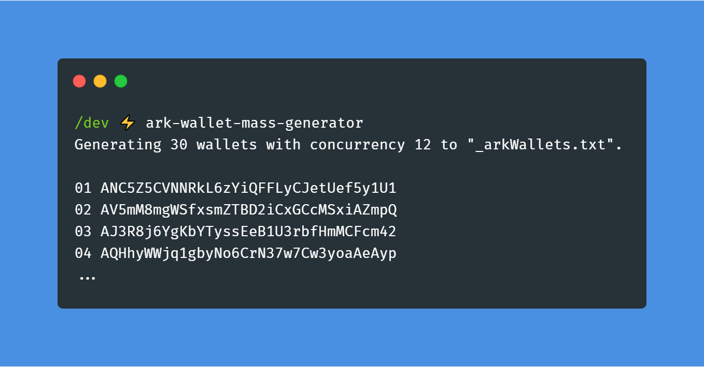

# ark-wallet-mass-generator
> Generate a lot a ARK wallets 👛



Generate a lot of [ARK](https://ark.io/) wallets quickly. This can be useful to find a nice wallet address.

## Install
```
$ yarn global add ark-wallet-mass-generator
# or npm i -g ark-wallet-mass-generator
```

## Usage
```
$ ark-wallet-mass-generator --help

    Usage
      $ ark-wallet-mass-generator
    
    Options
      --file -f         Output file (default: "_arkWallets.txt")
      --amount -a       Amount of wallets to generate (default: 30)
      --concurrency -c  Concurrent wallet generation (default: 12)
      --hideLogs        Hide logging output

    Example
      $ ark-wallet-mass-generator
      $ ark-wallet-mass-generator --file="_arkWallets.txt" --amount 500 -c 20
      $ ark-wallet-mass-generator --amount 50 --concurrency 8 --hideLogs

    https://github.com/rigwild/ark-wallet-mass-generator
```

## Related
 - [ipfs-ark-stamp](https://github.com/rigwild/ipfs-ark-stamp) - 📝 Add files to IPFS and stamp its IPFS CID hash permanently on the ARK Blockchain

## License
[The MIT license](./LICENSE)
